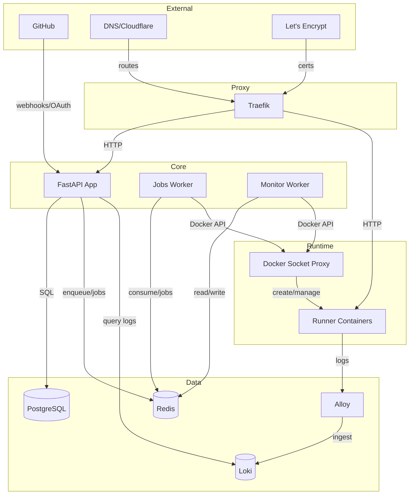

## Stack

/dev/push is built on a modern container-based stack:

- **Docker & Docker Compose** - Container orchestration
- **Traefik** - Reverse proxy and TLS termination
- **Loki** - Centralized log aggregation
- **Alloy** - Telemetry agent for log shipping
- **PostgreSQL** - Primary datastore
- **Redis** - Job queue and real-time updates
- **FastAPI** - Python web framework
- **arq** - Async job queue
- **HTMX** - Dynamic UI interactions
- **Alpine.js** - Lightweight JavaScript framework
- **Basecoat** - UI component library

## System Diagram



<Note>
  Runner containers write logs locally, which Alloy tails and ships to Loki. The app queries Loki to stream build/runtime logs to clients via Server-Sent Events (SSE).
</Note>

## Core Components

### App (FastAPI)

The main web application handles:

- User authentication and session management
- Team, project, and deployment management
- GitHub webhook processing
- SSE endpoints for real-time updates and log streaming
- Database operations via SQLAlchemy

**Key files:**
- `app/main.py` - Application entry point
- `app/routers/*` - Route handlers by domain
- `app/services/*` - Business logic services
- `app/models.py` - ORM models

### Workers

#### Jobs Worker

Background worker that processes async jobs from the Redis queue:

- `start_deployment` - Creates and starts runner containers
- `finalize_deployment` - Sets up aliases and routing
- `fail_deployment` - Handles deployment failures
- `delete_container` - Removes stopped containers
- `cleanup_inactive_containers` - Cleans up unused deployments
- `delete_*` - Team, project, user deletion jobs

**Configuration:**
- Max jobs: `8` concurrent
- Job timeout: Configurable via `job_timeout_seconds`
- Max retries: Configurable via `job_max_tries`
- Allow abort: `true`

**Files:** `app/workers/jobs.py`, `app/workers/tasks/*`

#### Monitor Worker

Continuously monitors running deployments:

- Polls every ~2 seconds
- Probes containers on port 8000 via `devpush_runner` network
- Detects container exits and failures
- Enqueues `finalize_deployment` on success
- Enqueues `fail_deployment` on errors
- Enforces deployment timeout limits

**File:** `app/workers/monitor.py`

### Traefik

Reverse proxy providing:

- HTTP/HTTPS routing for app and deployments
- Automatic TLS via ACME (Let's Encrypt)
- Docker provider for container labels
- File provider for aliases and custom domains
- Catch-all router for unknown deployments

**Certificate providers:**
- HTTP-01, DNS-01 (Cloudflare, Route53, Google, etc.)
- Configured via `CERT_CHALLENGE_PROVIDER` in `.env`

### Docker Socket Proxy

Secure Docker API access using `tecnativa/docker-socket-proxy`:

- Limited API exposure to workers and Traefik
- Prevents direct socket access
- Used for container creation and management

### PostgreSQL

Primary relational database storing:

- Users and authentication identities
- Teams and memberships
- Projects and configurations
- Deployments and their metadata
- Aliases, domains, and GitHub installations

<Info>
  Sensitive data (environment variables, OAuth tokens) is encrypted at rest using Fernet encryption.
</Info>

### Redis

Provides two critical functions:

1. **Job Queue** - ARQ-based async task queue
2. **Redis Streams** - Real-time UI updates

### Loki

Centralized log storage and querying:

- Stores build and runtime logs for deployments
- Queried via `/loki/api/v1/query_range` endpoint
- Logs streamed to users via SSE
- Labels: `project_id`, `deployment_id`, `environment_id`, `branch`, `stream`

## Networking

/dev/push uses three Docker networks:

- **`devpush_default`** - Public network (Traefik, app, Loki)
- **`devpush_internal`** - Internal services (PostgreSQL, Redis, Docker proxy)
- **`devpush_runner`** - Runner containers (Traefik and workers attach to route/probe)

<Note>
  The `devpush_runner` network isolates deployed applications while allowing Traefik to route traffic and workers to probe health.
</Note>

## Observability

### Logs

- Runner containers write to stdout/stderr
- Alloy tails container logs and ships to Loki
- App queries Loki and streams via SSE to users

### Status Updates

Redis Streams power real-time SSE updates:

- Project updates (new deployments, status changes)
- Deployment progress (prepare → deploy → finalize → completed)

### Health Checks

- App: `/health` endpoint
- Workers: ARQ `--check` command
- Services: Docker Compose healthchecks

## Security

### Sessions

- Signed cookies via Starlette `SessionMiddleware`
- CSRF protection enabled
- No Redis session storage

### Secrets

- Fernet encryption for environment variables and OAuth tokens
- Encryption key in `.env` file (`ENCRYPTION_KEY`)

### Container Security

- Docker socket access via limited proxy
- Runner containers run as non-root user
- Resource limits enforced (CPU, memory)
- `no-new-privileges` security option

## Scaling Considerations

- **Horizontal:** App and workers can scale behind Traefik
- **Vertical:** PostgreSQL and Redis can be sized independently
- **Cleanup:** Automated jobs keep inactive containers under control
- **Resource limits:** Configurable CPU and memory per deployment

## File Structure

```
/
├── app/                    # FastAPI application
│   ├── routers/           # Route handlers
│   ├── forms/             # WTForms definitions
│   ├── templates/         # Jinja2 templates
│   ├── services/          # Business logic
│   ├── workers/           # Background workers
│   └── migrations/        # Alembic migrations
├── compose/               # Docker Compose files
├── docker/                # Dockerfiles and entrypoints
├── scripts/               # Operational scripts
└── data/                  # Runtime data (prod: /var/lib/devpush)
```

## Operational Scripts

Key scripts in `scripts/`:

- `install.sh` - Initial installation
- `start.sh` - Start services
- `stop.sh` - Stop services
- `restart.sh` - Restart services
- `update.sh` - Update to new version
- `db-migrate.sh` - Run database migrations

<Info>
  Scripts support `--components <csv>` for scoped operations. Update scripts default to updating `app` only unless `--all`, `--full`, or specific components are specified.
</Info>