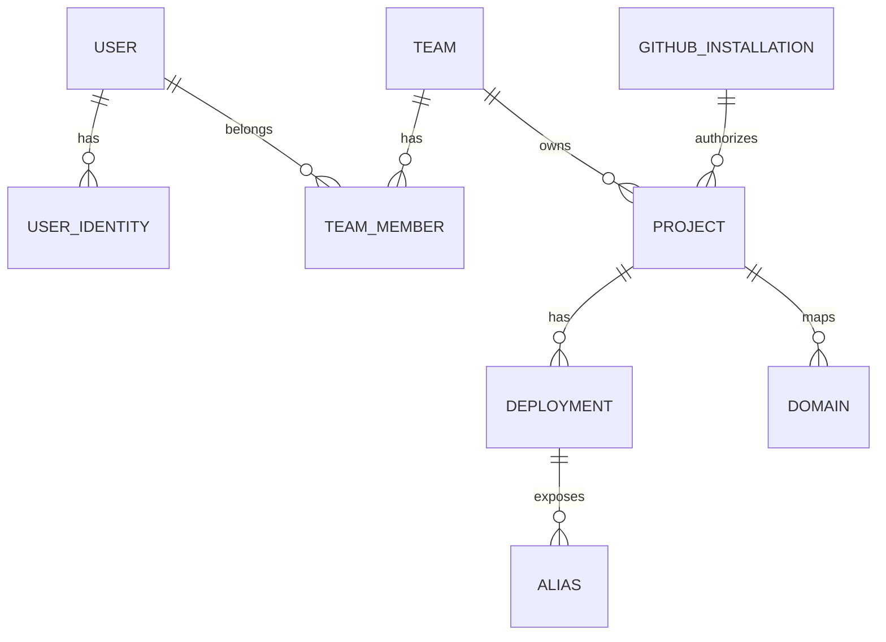

## Overview

/dev/push uses PostgreSQL as the primary datastore with SQLAlchemy async ORM. All models inherit from a common `Base` class and use timezone-naive UTC timestamps.

<Note>
  Project environment variables and OAuth tokens are encrypted at rest using Fernet encryption. Deployments capture a snapshot of project configuration at creation time.
</Note>

## Core Models

### User

**Table:** `user`

Represents a user account.

**Fields:**
- `id` (int, primary key)
- `email` (string, unique, indexed) - User email address
- `username` (string, unique, indexed) - Unique username
- `name` (string, nullable) - Display name
- `email_verified` (boolean, default: false)
- `has_avatar` (boolean, default: false)
- `status` (enum: active, deleted)
- `created_at` (datetime, indexed)
- `updated_at` (datetime, indexed)
- `tokens_invalid_before` (datetime, nullable) - Invalidate tokens before this time
- `default_team_id` (foreign key → Team)

**Relationships:**
- `default_team` → Team
- `identities` → List[UserIdentity]

### UserIdentity

**Table:** `user_identity`

Authentication provider credentials for a user.

**Fields:**
- `id` (int, primary key)
- `user_id` (foreign key → User, indexed)
- `provider` (enum: github, google, indexed)
- `provider_user_id` (string, indexed)
- `_access_token` (encrypted string, 2048 chars) - OAuth access token
- `_refresh_token` (encrypted string, 2048 chars) - OAuth refresh token
- `token_expires_at` (datetime, nullable)
- `password_hash` (string, nullable) - For password provider
- `provider_metadata` (JSON, nullable) - Provider-specific data
- `created_at` (datetime)
- `updated_at` (datetime)

**Constraints:**
- Unique: (`provider`, `provider_user_id`)

**Properties:**
- `access_token` - Decrypts `_access_token` on read
- `refresh_token` - Decrypts `_refresh_token` on read

**Relationships:**
- `user` → User

### Team

**Table:** `team`

A team that owns projects.

**Fields:**
- `id` (string, 32 chars, primary key) - Generated via `token_hex(16)`
- `name` (string, indexed)
- `slug` (string, unique, 40 chars max) - URL-friendly identifier
- `has_avatar` (boolean, default: false)
- `status` (enum: active, deleted)
- `created_by_user_id` (foreign key → User, nullable)
- `created_at` (datetime, indexed)
- `updated_at` (datetime, indexed)

**Relationships:**
- `projects` → List[Project]
- `storages` → List[Storage]
- `created_by_user` → User

**Properties:**
- `color` - Generated color based on team ID

**Slug Generation:**
Automatically generated after insert based on team name. Normalized to lowercase, alphanumeric with hyphens. Falls back to `team-{id}` if invalid.

<Info>
  Forbidden slugs include: `admin`, `api`, `assets`, `auth`, `deployment-not-found`, `health`, `new-team`, `setup`, `upload`, `user`.
</Info>

### TeamMember

**Table:** `team_member`

Membership relationship between users and teams.

**Fields:**
- `id` (int, primary key)
- `team_id` (foreign key → Team, indexed)
- `user_id` (foreign key → User, indexed)
- `role` (enum: owner, admin, member)
- `created_at` (datetime)

**Relationships:**
- `team` → Team
- `user` → User

### TeamInvite

**Table:** `team_invite`

Pending team invitations.

**Fields:**
- `id` (string, 32 chars, primary key)
- `team_id` (foreign key → Team, indexed)
- `email` (string, indexed)
- `role` (enum: owner, admin, member)
- `status` (enum: pending, accepted, revoked)
- `inviter_id` (foreign key → User, indexed)
- `created_at` (datetime)
- `expires_at` (datetime, default: 30 days from creation)

**Relationships:**
- `team` → Team
- `inviter` → User

### GithubInstallation

**Table:** `github_installation`

GitHub App installation credentials.

**Fields:**
- `installation_id` (int, primary key)
- `_token` (encrypted string, 2048 chars) - Installation access token
- `token_expires_at` (datetime, nullable)
- `status` (enum: active, deleted, suspended)

**Properties:**
- `token` - Decrypts `_token` on read

**Relationships:**
- `projects` → List[Project]

### Project

**Table:** `project`

A deployment project linked to a GitHub repository.

**Fields:**
- `id` (string, 32 chars, primary key)
- `name` (string, indexed)
- `has_avatar` (boolean, default: false)
- `repo_id` (bigint, indexed) - GitHub repository ID
- `repo_full_name` (string, indexed) - e.g., `owner/repo`
- `repo_status` (enum: active, deleted, removed, transferred)
- `github_installation_id` (foreign key → GithubInstallation, indexed)
- `environments` (JSON array) - List of environment configs
- `_env_vars` (encrypted text) - Environment variables
- `slug` (string, unique, 40 chars max)
- `config` (JSON object) - Project configuration (runner, commands, etc.)
- `created_by_user_id` (foreign key → User, nullable)
- `created_at` (datetime, indexed)
- `updated_at` (datetime, indexed)
- `status` (enum: active, paused, deleted)
- `team_id` (foreign key → Team, indexed)

**Constraints:**
- Unique: (`team_id`, `name`)
- Unique index: (`team_id`, `lower(name)`)

**Properties:**
- `env_vars` - Decrypts and parses `_env_vars` as JSON
- `hostname` - `{slug}.{deploy_domain}`
- `url` - Full URL to project
- `color` - Generated color
- `active_environments` - Filters environments with `status=active`
- `storages` - Linked storage resources

**Methods:**
- `get_env_vars(environment)` - Flattened env vars for environment
- `create_environment(name, slug, **kwargs)` - Create new environment
- `update_environment(id, values)` - Update environment
- `delete_environment(id)` - Soft delete environment
- `get_environment_by_id(id)` - Get environment by ID
- `get_environment_by_slug(slug)` - Get environment by slug
- `get_environment_hostname(slug)` - Get environment hostname
- `get_branch_hostname(branch)` - Get branch hostname

**Relationships:**
- `github_installation` → GithubInstallation
- `deployments` → List[Deployment]
- `team` → Team
- `created_by_user` → User
- `domains` → List[Domain]
- `storage_links` → List[StorageProject]

**Slug Generation:**
Automatically generated as `{name}-{team_slug}`, normalized and truncated to 40 chars.

### Deployment

**Table:** `deployment`

A deployment instance of a project at a specific commit.

**Fields:**
- `id` (string, 32 chars, primary key)
- `project_id` (foreign key → Project, indexed)
- `repo_id` (bigint, indexed) - Snapshot from project
- `repo_full_name` (string, indexed) - Snapshot from project
- `environment_id` (string, 8 chars) - Environment ID at creation
- `branch` (string, indexed)
- `commit_sha` (string, 40 chars, indexed)
- `commit_meta` (JSON object) - Commit metadata (author, message, etc.)
- `config` (JSON object) - Snapshot of project config
- `image` (string, nullable) - Runner image
- `_env_vars` (encrypted text) - Snapshot of env vars
- `job_id` (string, nullable) - ARQ job ID
- `error` (JSON object, nullable) - Error details if failed
- `container_id` (string, 64 chars, nullable) - Docker container ID
- `container_status` (enum: running, stopped, removed, nullable)
- `status` (enum: prepare, deploy, finalize, fail, completed)
- `conclusion` (enum: succeeded, failed, canceled, skipped, nullable)
- `trigger` (enum: webhook, user, api)
- `created_by_user_id` (foreign key → User, nullable)
- `created_at` (datetime, indexed)
- `concluded_at` (datetime, nullable, indexed)

**Lifecycle:**
1. `prepare` - Deployment created, preparing to start
2. `deploy` - Container created and starting
3. `finalize` - App ready, setting up aliases
4. `completed` - Deployment finished (with conclusion)

**Conclusions:**
- `succeeded` - Deployment successful and running
- `failed` - Deployment failed
- `canceled` - User canceled deployment
- `skipped` - Deployment skipped

**Properties:**
- `environment` - Gets environment config from project
- `env_vars` - Decrypts and parses `_env_vars`
- `slug` - `{project_slug}-id-{deployment_id[:7]}`
- `hostname` - `{slug}.{deploy_domain}`
- `url` - Full URL to deployment

**Relationships:**
- `project` → Project
- `aliases` → List[Alias]
- `created_by_user` → User

<Note>
  Deployments capture a snapshot of project configuration, environments, and environment variables at creation time. This ensures deployments are immutable and reproducible.
</Note>

### Alias

**Table:** `alias`

Routing aliases for deployments (branch, environment, environment_id).

**Fields:**
- `id` (int, primary key)
- `subdomain` (string, 63 chars, unique) - Subdomain for alias
- `deployment_id` (foreign key → Deployment, indexed) - Current deployment
- `previous_deployment_id` (foreign key → Deployment, indexed, nullable) - Previous deployment for rollback
- `type` (enum: branch, environment, environment_id)
- `value` (string, nullable) - Branch name, environment slug, or environment ID
- `updated_at` (datetime, indexed)

**Types:**
- `branch` - Branch-based alias (e.g., `{project}-branch-{branch}`)
- `environment` - Environment alias (e.g., `{project}-env-{env}`)
- `environment_id` - Environment ID alias (for production: `{project}`)

**Properties:**
- `hostname` - `{subdomain}.{deploy_domain}`
- `url` - Full URL to alias

**Relationships:**
- `deployment` → Deployment (current)
- `previous_deployment` → Deployment (for rollback)

**Methods:**
- `update_or_create(db, subdomain, deployment_id, type, value, environment_id)` - Update or create alias

<Info>
  Production environment aliases track the previous deployment to enable instant rollback functionality.
</Info>

### Domain

**Table:** `domain`

Custom domains mapped to projects.

**Fields:**
- `id` (int, primary key)
- `project_id` (foreign key → Project, indexed)
- `hostname` (string, indexed) - Custom domain
- `type` (enum: route, 301, 302, 307, 308) - Route or redirect type
- `environment_id` (string, nullable) - Target environment
- `status` (enum: pending, active, disabled, failed)
- `message` (text, nullable) - Status message
- `last_checked_at` (datetime, nullable)
- `created_at` (datetime)
- `updated_at` (datetime)

**Relationships:**
- `project` → Project

### Storage

**Table:** `storage`

Managed storage resources (databases, volumes, etc.).

**Fields:**
- `id` (string, 32 chars, primary key)
- `name` (string, indexed)
- `type` (enum: database, volume, kv, queue)
- `status` (enum: pending, active, resetting, deleted)
- `config` (JSONB object) - Storage configuration
- `error` (JSONB object, nullable) - Error details
- `created_by_user_id` (foreign key → User, nullable)
- `created_at` (datetime, indexed)
- `updated_at` (datetime, indexed)
- `team_id` (foreign key → Team, indexed)

**Constraints:**
- Unique: (`team_id`, `name`)
- Unique index: (`team_id`, `lower(name)`)

**Properties:**
- `projects` - Linked projects
- `color` - Type-based color (sky, amber, rose, green)

**Relationships:**
- `team` → Team
- `created_by_user` → User
- `project_links` → List[StorageProject]

### StorageProject

**Table:** `storage_project`

Links storage resources to projects.

**Fields:**
- `id` (string, 32 chars, primary key)
- `storage_id` (foreign key → Storage, indexed)
- `project_id` (foreign key → Project, indexed)
- `environment_ids` (JSONB array, nullable) - Environments with access
- `secrets` (JSONB object) - Connection secrets
- `created_at` (datetime)
- `updated_at` (datetime)

**Constraints:**
- Unique: (`storage_id`, `project_id`)

**Relationships:**
- `project` → Project
- `storage` → Storage

### Allowlist

**Table:** `allowlist`

Email/domain allowlist for registration.

**Fields:**
- `id` (int, primary key)
- `type` (enum: email, domain, pattern, indexed)
- `value` (string, indexed) - Email, domain, or pattern
- `created_at` (datetime, indexed)
- `updated_at` (datetime, indexed)

## Helper Functions

### utc_now()

Returns current UTC time as timezone-naive datetime. Used as default for timestamp fields.

### get_fernet()

Returns a cached Fernet instance using the encryption key from settings. Used for encrypting/decrypting sensitive fields.

## Encryption

Sensitive fields use Fernet symmetric encryption:

- `UserIdentity._access_token` and `_refresh_token`
- `GithubInstallation._token`
- `Project._env_vars`
- `Deployment._env_vars`

Encryption key is stored in `ENCRYPTION_KEY` environment variable and generated during installation.