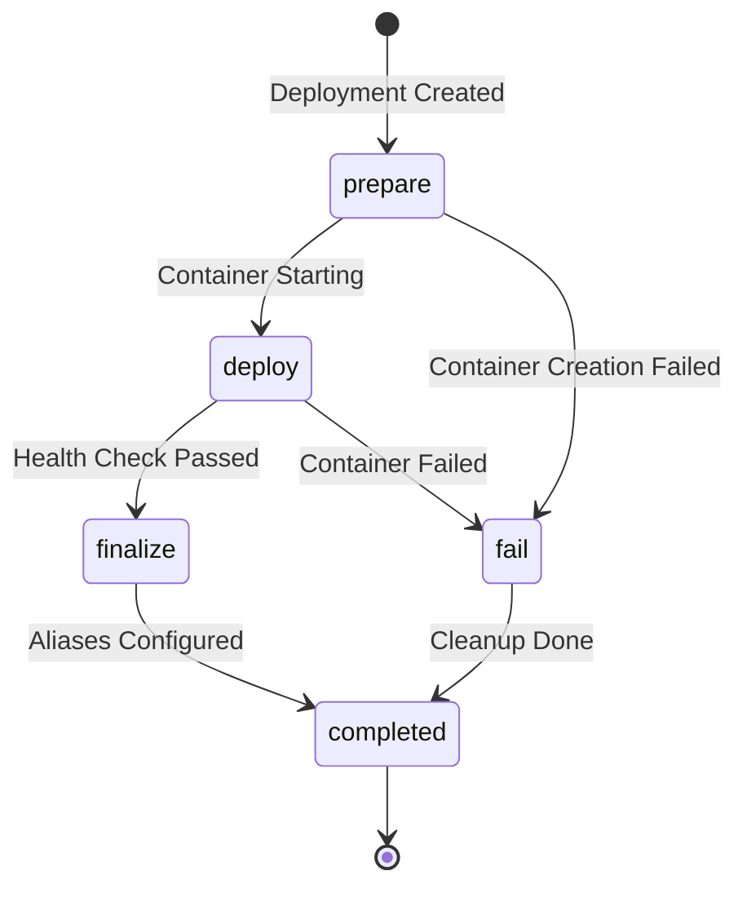

## Overview

Deployments in /dev/push follow a multi-stage workflow orchestrated by background workers. The process involves container creation, application startup, health monitoring, and routing configuration.

## Deployment Lifecycle

Deployments progress through the following statuses:

1. **`prepare`** - Deployment created, preparing to start
2. **`deploy`** - Container created and starting
3. **`finalize`** - Application ready, setting up aliases
4. **`fail`** - Transient state for failure handling
5. **`completed`** - Final state with conclusion (succeeded/failed/canceled/skipped)



## Step-by-Step Flow

### 1. Trigger

Deployments can be triggered in three ways:

**Webhook Trigger:**
- GitHub webhook received at `/api/github/webhook`
- Webhook signature verified
- Project resolved from repository
- Deployment record created in database
- `start_deployment` job enqueued

**Manual Trigger:**
- User selects commit and environment in UI
- Deployment record created
- `start_deployment` job enqueued

**API Trigger:**
- API request creates deployment
- Same flow as manual trigger

**Deployment Record Fields:**
- Snapshots project config, env vars, and environment settings
- Records commit SHA, branch, and commit metadata
- Sets `status='prepare'` and `trigger` type

### 2. Start Deployment (`start_deployment`)

**Job:** `app/workers/tasks/deployment.py:start_deployment`

This job creates and starts the runner container.

**Steps:**

1. **Update Status** - Mark deployment as `prepare`
2. **Prepare Environment Variables**
   - Merge project env vars with runtime vars
   - Add `DEVPUSH_*` system variables
   - Fetch GitHub installation token
3. **Build Command Chain**
   - Clone repository at specific commit SHA
   - Change to root directory if configured
   - Run build command (install dependencies)
   - Run pre-deploy command
   - Start application
4. **Pull Runner Image** (if not present)
   - Check if runner image exists locally
   - Pull from registry if needed
   - Log progress to Loki
5. **Create Container**
   - Select runner image from project config
   - Apply resource limits (CPU, memory)
   - Attach to `devpush_runner` network
   - Configure Traefik labels for routing
   - Set up logging configuration
6. **Start Container** - Execute command chain
7. **Update Status** - Mark deployment as `deploy`, save container ID

<Note>
  The GitHub installation token is injected as `DEVPUSH_GITHUB_TOKEN` and used with a custom Git askpass script for authenticated cloning. The token is removed from the environment after cloning.
</Note>

**Container Configuration:**

```python
{
  "Image": runner_image,  # e.g., ghcr.io/devpushhq/runner-python-3.12:1.0.0
  "Cmd": ["/bin/sh", "-c", " && ".join(commands)],
  "Env": [f"{k}={v}" for k, v in env_vars_dict.items()],
  "WorkingDir": "/app",
  "Labels": {  # Traefik routing labels
    "traefik.enable": "true",
    f"traefik.http.routers.{router}.rule": f"Host(`{slug}.{domain}`)",
    ...
  },
  "NetworkingConfig": {"EndpointsConfig": {"devpush_runner": {}}},
  "HostConfig": {
    "CpuQuota": int(cpus * 100000),  # CPU limit
    "Memory": memory_mb * 1024 * 1024,  # Memory limit
    "Binds": mounts,  # Volume mounts
    "SecurityOpt": ["no-new-privileges:true"],
    "LogConfig": {"Type": "json-file", "Config": {"max-size": "10m", "max-file": "5"}}
  }
}
```

**Traefik Labels:**

- `traefik.enable=true` - Enable routing
- `traefik.http.routers.{router}.rule=Host(...)` - Routing rule
- `traefik.http.services.{router}.loadbalancer.server.port=8000` - Target port
- `traefik.http.routers.{router}.entrypoints=websecure` - HTTPS entry point
- `traefik.http.routers.{router}.tls.certresolver=le` - Let's Encrypt
- DevPush labels: `devpush.deployment_id`, `devpush.project_id`, `devpush.environment_id`, `devpush.branch`

**Error Handling:**

If container creation fails:
- Enqueue `fail_deployment` job with reason
- Log error and return
- Common errors: image not found, port conflict, resource limits

### 3. Monitor (`monitor.py`)

**Worker:** `app/workers/monitor.py`

Continuous monitoring of running deployments.

**Polling Loop:**

- Runs every 2 seconds
- Queries deployments with `status='deploy'` and `container_status='running'`
- Checks each deployment in parallel

**Health Check Process:**

1. **Timeout Check**
   - Compare `created_at` against `deployment_timeout_seconds`
   - Enqueue `fail_deployment` if timed out
2. **Container Status Check**
   - Get container info from Docker API
   - Check `State.Status`
3. **Exit Detection**
   - If container exited, determine reason from exit code:
     - `0` - App exited unexpectedly
     - `137` - Killed (OOM or manual stop)
     - `1` - Crashed on startup
     - Other - Generic error
   - Enqueue `fail_deployment` with appropriate message
4. **HTTP Probe**
   - Get container IP from `devpush_runner` network
   - Probe `http://{ip}:8000/` with 5-second timeout
   - On success:
     - Update status to `finalize`
     - Enqueue `finalize_deployment`
     - Remove from monitoring state

<Info>
  The monitor worker maintains a probe state dictionary to prevent concurrent probes for the same deployment. This ensures efficient resource usage during health checks.
</Info>

**Probe Implementation:**

```python
async def _http_probe(ip: str, port: int, timeout: float = 5) -> bool:
    try:
        async with httpx.AsyncClient(timeout=timeout) as client:
            await client.get(f"http://{ip}:{port}/")
            return True
    except Exception:
        return False
```

### 4a. Finalize Deployment (`finalize_deployment`)

**Job:** `app/workers/tasks/deployment.py:finalize_deployment`

Called when the application is healthy and ready.

**Steps:**

1. **Check Cancellation** - Skip if deployment already canceled
2. **Setup Aliases**
   - Create/update branch alias
   - Create/update environment alias
   - Create/update environment ID alias
   - For production: track previous deployment for rollback
3. **Update Traefik Config**
   - Generate dynamic file configuration for aliases
   - Write to `{traefik_dir}/{project_id}.yml`
   - Include custom domain routes if configured
4. **Update Status** - Mark `status='completed'`, `conclusion='succeeded'`
5. **Enqueue Cleanup** - Queue `cleanup_inactive_containers` for project

**Alias Types:**

| Type | Subdomain Format | Example |
|------|-----------------|----------|
| `branch` | `{project}-branch-{branch}` | `myapp-example-branch-main.devpush.app` |
| `environment` | `{project}-env-{env}` | `myapp-example-env-staging.devpush.app` |
| `environment_id` | `{project}` (for production) | `myapp-example.devpush.app` |

**Traefik Dynamic Config:**

Generated YAML file per project:

```yaml
http:
  routers:
    alias-123:
      rule: "Host(`myapp-example-env-staging.devpush.app`)"
      service: "deployment-abc123@docker"
      priority: 20
      entrypoints:
        - websecure
      tls:
        certResolver: le
```

### 4b. Fail Deployment (`fail_deployment`)

**Job:** `app/workers/tasks/deployment.py:fail_deployment`

Called when deployment fails at any stage.

**Steps:**

1. **Check State** - Skip if already canceled or concluded
2. **Update Status** - Mark `status='fail'`
3. **Stop Container** (if running)
   - Stop container via Docker API
   - Enqueue `delete_container` with grace period
   - Update `container_status='stopped'`
4. **Update Status** - Mark `status='completed'`, `conclusion='failed'`
5. **Save Error** - Record error status and message in `error` field

**Error Object:**

```json
{
  "status": "deploy",
  "message": "Container stopped unexpectedly. Check the deployment logs for errors."
}
```

### 5. Container Cleanup

#### Delete Container (`delete_container`)

**Job:** `app/workers/tasks/deployment.py:delete_container`

Deletes a specific container after a grace period.

**Default Grace Period:** Configured via `container_delete_grace_seconds`

**Steps:**

1. Get deployment by ID
2. Stop container (if running)
3. Delete container with `force=true`
4. Update `container_status='removed'`

#### Cleanup Inactive Containers (`cleanup_inactive_containers`)

**Job:** `app/workers/tasks/deployment.py:cleanup_inactive_containers`

Cleans up containers for deployments no longer referenced by aliases.

**Steps:**

1. **Get Project** - Fetch project by ID
2. **Find Active Deployments**
   - Query aliases for `deployment_id` and `previous_deployment_id`
   - Build set of active deployment IDs
3. **Find Inactive Deployments**
   - Query deployments with:
     - `project_id` matches
     - `container_id` is not null
     - `container_status='running'`
     - `status='completed'`
     - ID not in active set
4. **Stop and Remove**
   - Stop each inactive container
   - Remove container
   - Update `container_status='removed'`
5. **Commit Updates**

<Note>
  This cleanup job ensures that only deployments currently serving traffic (via aliases) keep their containers running. All other completed deployments have their containers removed to conserve resources.
</Note>

## Background Job Queue

### ARQ Configuration

**File:** `app/workers/jobs.py`

**Settings:**
- **Max Jobs:** 8 concurrent jobs
- **Job Timeout:** Configurable via `job_timeout_seconds` (default varies)
- **Completion Wait:** Configurable via `job_completion_wait_seconds`
- **Max Tries:** Configurable via `job_max_tries`
- **Health Check Interval:** 65 seconds
- **Allow Abort:** true

### Job Functions

All jobs available in the queue:

**Deployment:**
- `start_deployment(deployment_id)`
- `finalize_deployment(deployment_id)`
- `fail_deployment(deployment_id, status, reason)`
- `delete_container(deployment_id)`
- `cleanup_inactive_containers(project_id, remove_containers=True)`

**Deletion:**
- `delete_user(user_id)`
- `delete_team(team_id)`
- `delete_project(project_id)`

**Storage:**
- `provision_storage(storage_id)`
- `deprovision_storage(storage_id)`
- `reset_storage(storage_id)`

**Registry:**
- `pull_runner_image(runner_slug)`
- `pull_all_runner_images()`
- `clear_runner_image(runner_slug)`
- `clear_all_runner_images()`

### Job Enqueueing

Jobs are enqueued via the `ArqRedis` connection:

```python
await queue.enqueue_job(
    "start_deployment",
    deployment_id,
    _defer_by=0  # Optional delay in seconds
)
```

## Real-Time Updates

### Redis Streams

Deployment status updates are published to Redis Streams for real-time UI updates.

**Stream Key:** `project:{project_id}:updates`

**Event Payload:**

```json
{
  "type": "deployment_update",
  "deployment_id": "abc123...",
  "status": "deploy",
  "conclusion": null,
  "container_status": "running",
  "error": null
}
```

### SSE Endpoints

**File:** `app/routers/event.py`

Server-Sent Events endpoints:

- **Project Updates:** `/api/projects/{project_id}/events`
- **Deployment Logs:** `/api/deployments/{deployment_id}/logs`

## Logging

### Log Shipping

1. **Container Logs** - Written to stdout/stderr by runner containers
2. **Alloy** - Tails container logs via Docker log driver
3. **Loki** - Receives logs from Alloy and stores with labels

**Log Labels:**
- `project_id`
- `deployment_id`
- `environment_id`
- `branch`
- `stream` (stdout/stderr)

### Log Querying

**Service:** `LokiService` (`app/services/loki.py`)

**Endpoint:** `/loki/api/v1/query_range`

**Query Example:**

```logql
{deployment_id="abc123"}
```

Logs are streamed to users via SSE, allowing real-time viewing of build and runtime logs.

## Error Scenarios

### Common Failure Cases

| Scenario | Detection | Handling |
|----------|-----------|----------|
| **Image not found** | Container creation fails | `fail_deployment` with "Runner image not found" |
| **Port conflict** | Container creation fails | `fail_deployment` with "Port conflict" message |
| **App crashes** | Container exits with code 1 | `fail_deployment` with "App crashed on startup" |
| **Out of memory** | Container exits with code 137 | `fail_deployment` with "Killed (out of memory)" |
| **Timeout** | Monitor detects age > timeout | `fail_deployment` with "Timed out" message |
| **Health check fails** | HTTP probe never succeeds | Timeout eventually triggers failure |
| **Container exits** | Container status becomes "exited" | `fail_deployment` based on exit code |

### Cancellation

Users can cancel in-progress deployments:

1. **Cancel Request** - User cancels via UI
2. **Abort Job** - ARQ aborts `start_deployment` job
3. **Catch Cancellation** - Job catches `asyncio.CancelledError`
4. **Stop Container** - Container stopped
5. **Enqueue Delete** - `delete_container` queued with grace period
6. **Update Status** - Mark `conclusion='canceled'`

<Info>
  Canceled deployments have their containers stopped immediately and removed after a grace period to allow log collection.
</Info>

## Configuration Options

### Deployment Config (Project)

Stored in `project.config` JSON field:

```json
{
  "runner": "python-3.12",
  "root_directory": "./",
  "build_command": "pip install -r requirements.txt",
  "pre_deploy_command": "python manage.py migrate",
  "start_command": "uvicorn main:app --host 0.0.0.0 --port 8000",
  "cpus": 1.0,
  "memory": 512
}
```

### Resource Limits

- **CPU:** Configurable via `cpus` (if `allow_custom_cpu=true`), capped at `max_cpus`
- **Memory:** Configurable via `memory` (if `allow_custom_memory=true`), capped at `max_memory_mb`
- **Defaults:** `default_cpus` and `default_memory_mb` from settings

### Timeouts

- **Deployment Timeout:** `deployment_timeout_seconds` (default: varies by config)
- **Job Timeout:** `job_timeout_seconds`
- **Container Delete Grace:** `container_delete_grace_seconds`